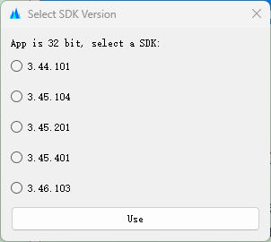
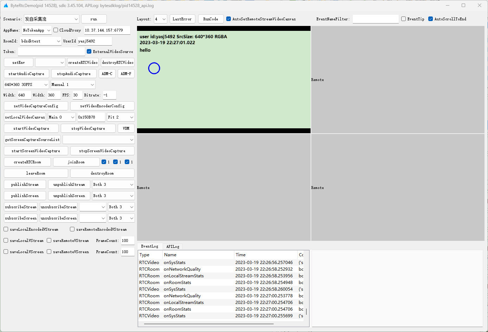
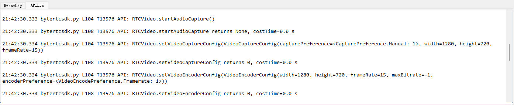
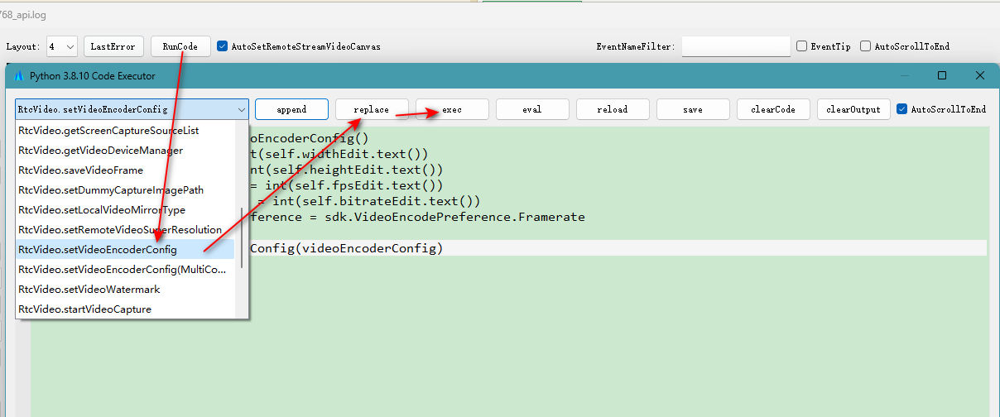
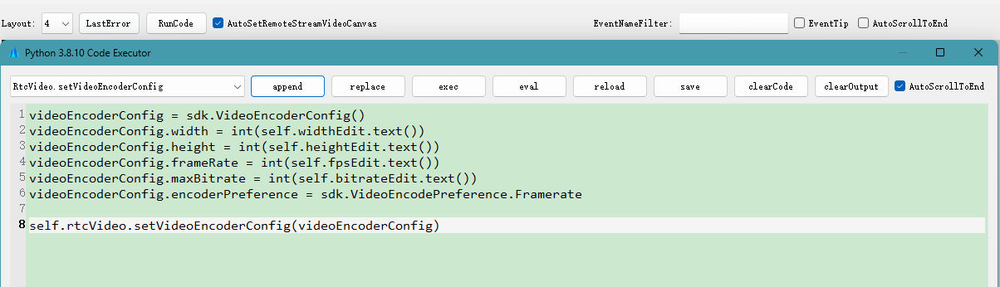
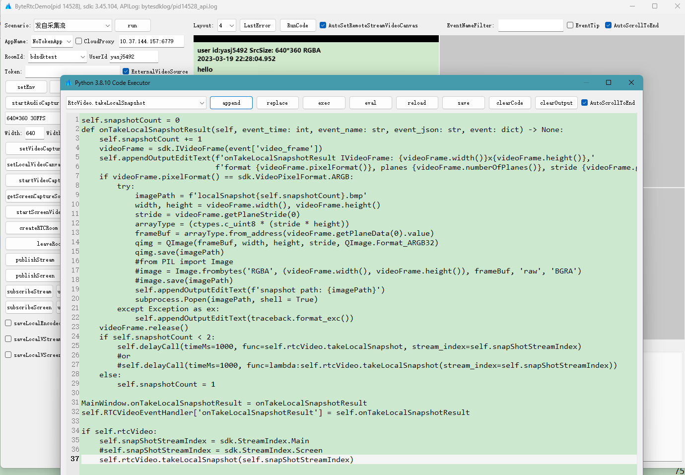

[火山引擎RTC](https://www.volcengine.com/product/veRTC) API Demo

Demo功能：

1，使用Python封装了C++ API和回调

2，一个Demo程序可以支持多个sdk版本

3，可以查看SDK所有回调记录、支持回调记录过滤、自动显示回调参数里的枚举类型信息

4，调用API时自动生成调用记录，显示API参数、返回值和耗时，

5，Demo代码编辑器提供Python API模板，可以修改模板代码测试所有API参数

6，可用Demo代码编辑器实现任意API和回调的组合调用，模拟各种场景下的API调用

下面代码为本地视频截图的调用，定义回调函数onTakeLocalSnapshotResult为本地视频截图API takeLocalSnapshot的回调。
当回调执行时，在回调里执行异步延迟调用1秒后再调用一次API截图。

