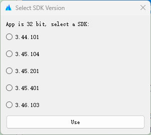
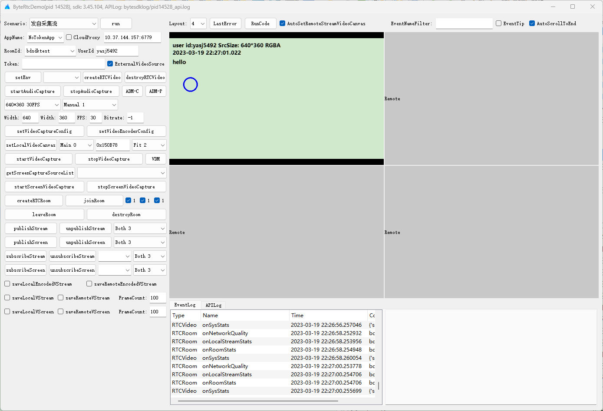
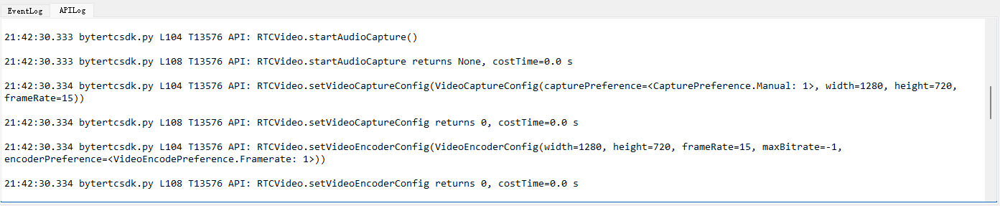
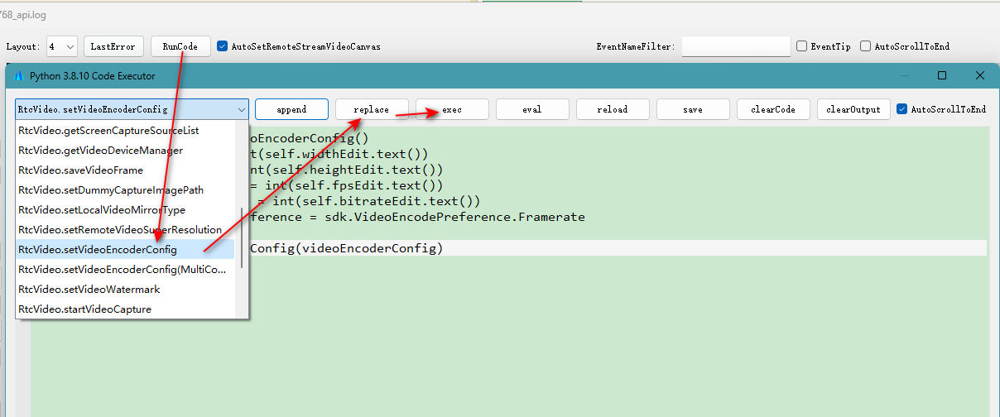
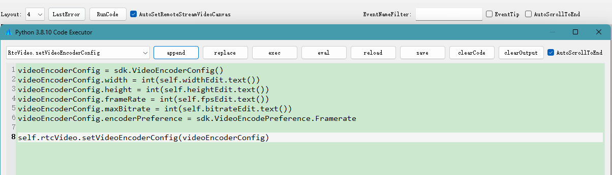
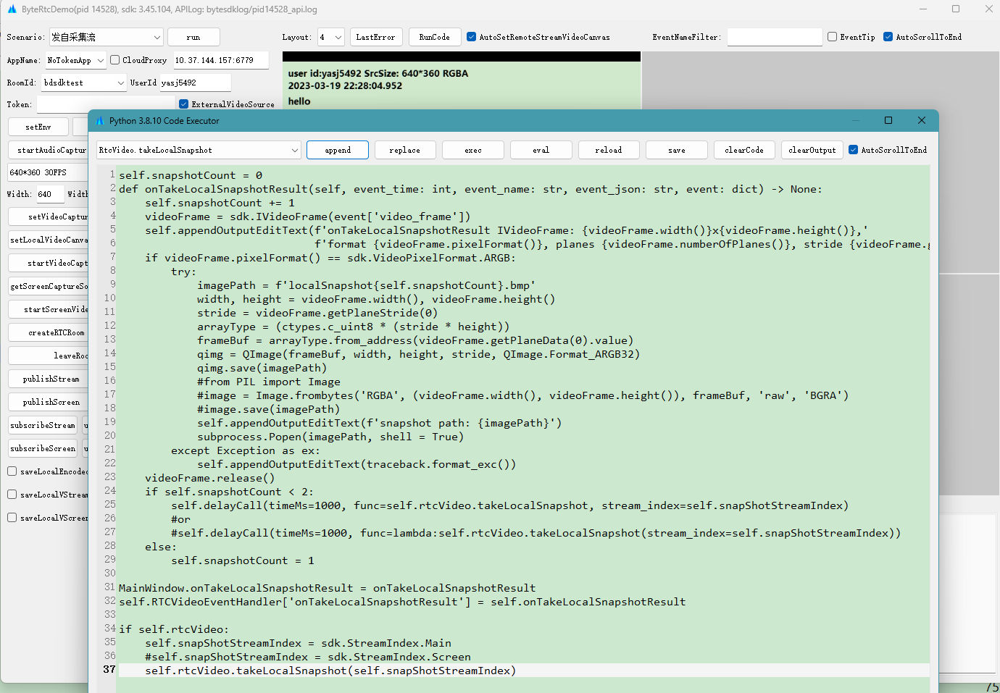

[火山引擎RTC](https://www.volcengine.com/product/veRTC) API 测试程序

程序功能：

1，使用Python封装了C++ API和回调

2，一个程序可以支持多个sdk版本

3，可以查看SDK所有回调记录、支持回调记录过滤、自动显示回调参数里的枚举类型信息

4，调用API时自动生成调用记录，显示API参数、返回值和耗时，

5，内嵌代码编辑器，允许以Python脚本形式任意编排SDK API的调用顺序、动态编辑参数

6，实现了SDK回调到Python回调函数的自动映射，支持在回调中执行任意逻辑（如条件判断、延迟调用、链式触发），极大增强了对时序相关、异步交互类Bug的复现与定位能力。

下面代码为本地视频截图的调用，定义回调函数onTakeLocalSnapshotResult为本地视频截图API takeLocalSnapshot的回调。
当回调执行时，在回调里执行异步延迟调用1秒后再调用一次API截图。

